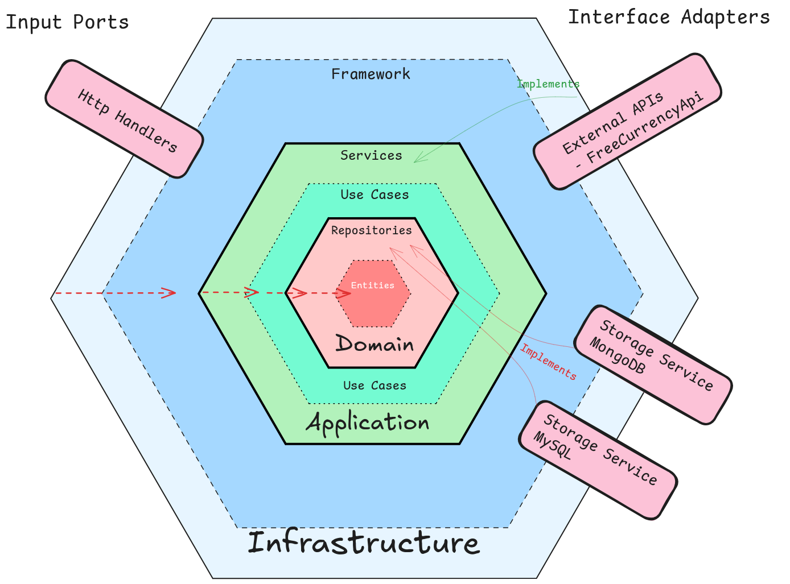

# Clean Architecture in Golang

## App features
### Use Cases
- Add employees and their salary
- Get the salary from an employee in a desired currency

### Storage
There are implementations in:
- MySql `--storage mysql`
- MongoDb `--storage mongo`
- In memory (default)

### External APIs
Exchange rates can be retrieved from:
- Local currency converter (default)
- Free Currency Api, token required. [Link](https://app.freecurrencyapi.com/) `--currency-converter api`

## Structure

## Code decisions and conventions
- [Gitmoji](https://gitmoji.dev/) is used for commit messages
- Number of external libraries kept to a minimum

## Things to improve / Things missing
- Docker compose and images
- How to run locally
- Improve error handling
- Add more unit tests
- Add integration and functional tests
- Add profile/config manager